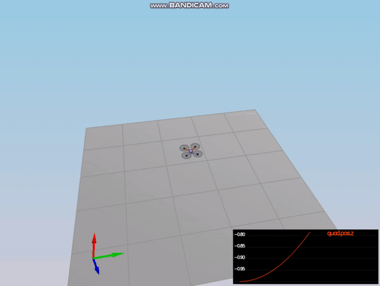
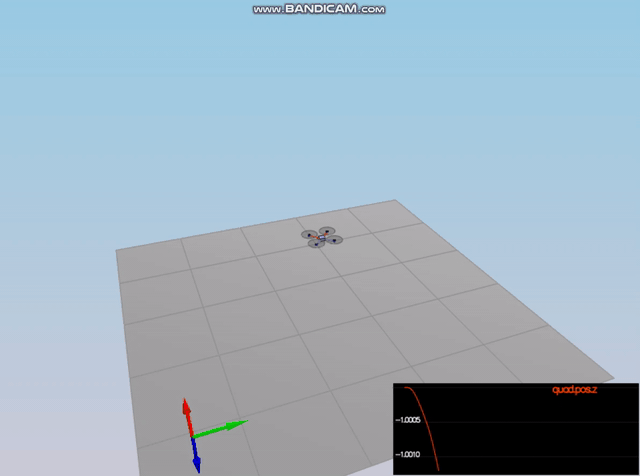
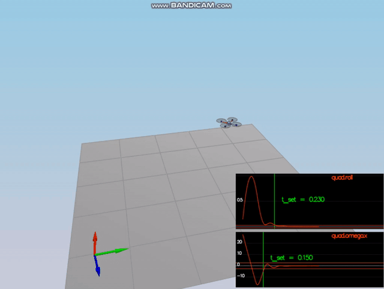
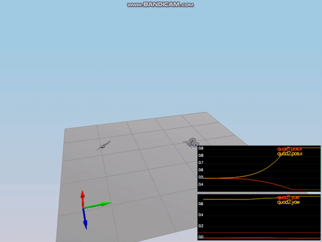

# The C++ Project Readme #

This is the readme for the C++ project.

For easy navigation throughout this document, here is an outline:

 - [Project Description](#project-description)
 - [Development environment setup](#development-environment-setup)
 - [Simulator walkthrough](#simulator-walkthrough)
 - [The tasks](#the-tasks)
 - [Evaluation](#evaluation)

# Project description

In this project, we implement and tune a [cascade PID controller](https://controlstation.com/cascade-control-cascade-control-configured/) in a simulator for quadcopter. 
The controller design uses feed-forward strategy as explained in this paper, [Feed-Forward Parameter Identification for Precise Periodic
Quadrocopter Motions](http://www.dynsyslab.org/wp-content/papercite-data/pdf/schoellig-acc12.pdf), by
[Angela P. Schoellig](http://www.dynsyslab.org/prof-angela-schoellig/).
 The following diagram could be found on that paper describing the cascaded control loops of the trajectory-following controller:


## Implementation

The simulator is realistic in the physics that it models. So we need to put some constraints on the 
outputs of different part of the controller otherwise things can go wrong when some of those 
limits are not implemented correctly. Instructions on how to use the simulator can be found in [How to use simulator](How_to_use_simulator.md). 
There are in total five scenarios that cover all the aspects of the controller.

- [/config/QuadControlParams.txt](./config/QuadControlParams.txt): This file contains all control gains and other desired tuning parameters.
- [/src/QuadControl.cpp](./src/QuadControl.cpp): This file contains all of the code for the controller.


## Development Environment Setup ##

Regardless of your development platform, the first step is to download or clone this repository.

Once you have the code for the simulator, you will need to install the necessary compiler and IDE necessary for running the simulator.

Here are the setup and install instructions for each of the recommended IDEs for each different OS options:

### Windows ###

For Windows, the recommended IDE is Visual Studio.  Here are the steps required for getting the project up and running using Visual Studio.

1. Download and install [Visual Studio](https://www.visualstudio.com/vs/community/)
2. Select *Open Project / Solution* and open `<simulator>/project/Simulator.sln`
3. From the *Project* menu, select the *Retarget solution* option and select the Windows SDK that is installed on your computer (this should have been installed when installing Visual Studio or upon opening of the project).
4. Make sure platform matches the flavor of Windows you are using (x86 or x64). The platform is visible next to the green play button in the Visual Studio toolbar:


5. To compile and run the project / simulator, simply click on the green play button at the top of the screen.  When you run the simulator, you should see a single quadcopter, falling down.


### OS X ###

For Mac OS X, the recommended IDE is XCode, which you can get via the App Store.

1. Download and install XCode from the App Store if you don't already have it installed.
2. Open the project from the `<simulator>/project` directory.
3. After opening project, you need to set the working directory:
  1. Go to *(Project Name)* | *Edit Scheme*
  2. In new window, under *Run/Debug* on left side, under the *Options* tab, set Working Directory to `$PROJECT_DIR` and check ‘use custom working directory’.
  3. Compile and run the project. You should see a single quadcopter, falling down.


### Linux ###

For Linux, the recommended IDE is QtCreator.

1. Download and install QtCreator.
2. Open the `.pro` file from the `<simulator>/project` directory.
3. Compile and run the project (using the tab `Build` select the `qmake` option.  You should see a single quadcopter, falling down.

**NOTE:** You may need to install the GLUT libs using `sudo apt-get install freeglut3-dev`


### Advanced Versions ###

These are some more advanced setup instructions for those of you who prefer to use a different IDE or build the code manually.  Note that these instructions do assume a certain level of familiarity with the approach and are not as detailed as the instructions above.

#### CLion IDE ####

For those of you who are using the CLion IDE for developement on your platform, we have included the necessary `CMakeLists.txt` file needed to build the simulation.

#### CMake on Linux ####

For those of you interested in doing manual builds using `cmake`, we have provided a `CMakeLists.txt` file with the necessary configuration.

**NOTE: This has only been tested on Ubuntu 16.04, however, these instructions should work for most linux versions.  Also note that these instructions assume knowledge of `cmake` and the required `cmake` dependencies are installed.**

1. Create a new directory for the build files:

```sh
cd FCND-Controls-CPP
mkdir build
```

2. Navigate to the build directory and run `cmake` and then compile and build the code:

```sh
cd build
cmake ..
make
```

3. You should now be able to run the simulator with `./CPPSim` and you should see a single quadcopter, falling down.

## Simulator Walkthrough ##

Now that you have all the code on your computer and the simulator running, let's walk through some of the elements of the code and the simulator itself.

### The Code ###

For the project, the majority of your code will be written in `src/QuadControl.cpp`.  This file contains all of the code for the controller that you will be developing.

All the configuration files for your controller and the vehicle are in the `config` directory.  For example, for all your control gains and other desired tuning parameters, there is a config file called `QuadControlParams.txt` set up for you.  An import note is that while the simulator is running, you can edit this file in real time and see the affects your changes have on the quad!

The syntax of the config files is as follows:

 - `[Quad]` begins a parameter namespace.  Any variable written afterwards becomes `Quad.<variablename>` in the source code.
 - If not in a namespace, you can also write `Quad.<variablename>` directly.
 - `[Quad1 : Quad]` means that the `Quad1` namespace is created with a copy of all the variables of `Quad`.  You can then overwrite those variables by specifying new values (e.g. `Quad1.Mass` to override the copied `Quad.Mass`).  This is convenient for having default values.

You will also be using the simulator to fly some difference trajectories to test out the performance of your C++ implementation of your controller. These trajectories, along with supporting code, are found in the `traj` directory of the repo.


### The Simulator ###

In the simulator window itself, you can right click the window to select between a set of different scenarios that are designed to test the different parts of your controller.

The simulation (including visualization) is implemented in a single thread.  This is so that you can safely breakpoint code at any point and debug, without affecting any part of the simulation.

Due to deterministic timing and careful control over how the pseudo-random number generators are initialized and used, the simulation should be exactly repeatable. This means that any simulation with the same configuration should be exactly identical when run repeatedly or on different machines.

Vehicles are created and graphs are reset whenever a scenario is loaded. When a scenario is reset (due to an end condition such as time or user pressing the ‘R’ key), the config files are all re-read and state of the simulation/vehicles/graphs is reset -- however the number/name of vehicles and displayed graphs are left untouched.

When the simulation is running, you can use the arrow keys on your keyboard to impact forces on your drone to see how your controller reacts to outside forces being applied.

#### Keyboard / Mouse Controls ####

There are a handful of keyboard / mouse commands to help with the simulator itself, including applying external forces on your drone to see how your controllers reacts!

 - Left drag - rotate
 - X + left drag - pan
 - Z + left drag - zoom
 - arrow keys - apply external force
 - C - clear all graphs
 - R - reset simulation
 - Space - pause simulation

## Scenarios ##

#### Scenario 1: Intro
If the mass doesn't match the actual mass of the quad, it'll fall down. 
So we tune the Mass parameter in [/config/QuadControlParams.txt](./config/QuadControlParams.txt) to make the vehicle more or less stay in the same spot.

Before:


After:


The standard output when the scenario 1 passes:

```
PASS: ABS(Quad.PosFollowErr) was less than 0.500000 for at least 0.800000 seconds
```

#### Scenario 2: Body rate and roll/pitch control

To accomplish this I implemented:

* [GenerateMotorCommands method](./src/QuadControl.cpp#L56-L90) - It implement these equations:


`F_0` to `F_3` are the individual motor's thrust, `tau(x,y,z)` are the moments along xyz axes.
`F_t` is the total thrust, `kappa` is the drag/thrust ratio and `l` is the drone arm length over square root of 2.\
(The calculation implementation for the motor commands is in [/src/QuadControl::GenerateMotorCommands method ](./src/QuadControl.cpp#L56-L90) from line 56 to 90)

**NOTE:** We are using NED coordinates ie, the `z` axis is inverted. This means the 
yaw is defined positive when drones yaw clockwise looking from above.

* [BodyRateControl method](./src/QuadControl.cpp#L92-L125) - A [P controller](https://en.wikipedia.org/wiki/Proportional_control) that controls body rate ie roll rate,
 pitch rate and yaw rate.
 
At this point, the `kpPQR` parameter has to be tuned to stop the drone from flipping.\
(The body rate control is implemented in [/src/QuadControl::BodyRateControl method ](./src/QuadControl.cpp#L92-L125) from line 92 to 125)

* [RollPitchControl method](./src/QuadControl.cpp#L128-L165) - A P controller for the roll, pitch and yaw. 


This controller receives the commanded accelerations in x and y directions. And to achieve these accelerations
 we need to apply a P controller to the elements `R13` and `R23` of the [rotation matrix](https://en.wikipedia.org/wiki/Rotation_matrix) from world frame to body frame.\
(The roll pitch control is implemented in [/src/QuadControl::::RollPitchControl method ](./src/QuadControl.cpp#L128-L165) from line 128 to 165)


But to output roll and pitch rates we another equation to apply:


**NOTE:** It is important to note that the thrust received is positive but while working with NED coordinates
we need it to be inverted and converted to acceleration before applying the equations. 
After the implementation is done, start tuning `kpBank` and `kpPQR`.



The standard output when the scenario 2 passes:

```
PASS: ABS(Quad.Roll) was less than 0.025000 for at least 0.750000 seconds
PASS: ABS(Quad.Omega.X) was less than 2.500000 for at least 0.750000 seconds
```

#### Scenario 3: Position/velocity and yaw angle control

There are three methods to implement here:

* [AltitudeControl](./src/QuadControl.cpp#L167-L208): This is a [PD controller](https://en.wikipedia.org/wiki/PID_controller) to control the acceleration in z direction and outputs the thrust needed to control the altitude.


Here, c is the magnitude of acceleration produced by the motors thrust. We already included the direction of c 
while subtracting the matrix.\
(The altitude control is implemented in [/src/QuadControl::AltitudeControl method ](./src/QuadControl.cpp#L167-L208) from line 167 to 208)

* [LateralPositionControl](./src/QuadControl.cpp#L211-L254) Here we use a cascaded proportional controller: an inner one for velocity, 
with gain Kv and an outer one with gain Kp to control accelerations in 
`x` and `y` direction.\
(The lateral position control is implemented in [/src/QuadControl::LateralPositionControl method ](./src/QuadControl.cpp#L211-L254) from line 211 to 254)


* [YawControl](./src/QuadControl.cpp#L257-L292): This is a simple P controller which outputs the yaw rate (in body frame). We wrap the yaw error in range `[-pi, pi]`.

When looking at a controller linearized for small motions, r is approximately equal to the yaw rate.  If we used a linearized controller for roll and pitch, the equations would also be much simpler, but we would have much larger control errors, so we need to take into account the attitude in those cases.  For yaw, with this type of control, we can get away with keeping the linearized assumption on the controller, which is why we pass yaw rate back directly without taking into account the attitude.\
(The yaw control is implemented in [/src/QuadControl::YawControl method ](./src/QuadControl.cpp#L257-L292) from line 257 to 292)

We start tuning for altitude controller using `kpPosZ` and `kpVelZ` and then move to tuning 
the lateral controller by using `kpPosXY`, `kpVelXY`. In last we tune yaw controller with `kpYaw` 
. Here is a video of the scenario when it passes:

Before:


After:


The standard output when the scenario 3 passes:

```
PASS: ABS(Quad1.Pos.X) was less than 0.100000 for at least 1.250000 seconds
PASS: ABS(Quad2.Pos.X) was less than 0.100000 for at least 1.250000 seconds
PASS: ABS(Quad2.Yaw) was less than 0.100000 for at least 1.000000 seconds
```

#### Scenario 4: Non-idealities and robustness

By now each controller is implemented and tuned. 
Ok, now we need to add an integral part to the altitude controller to move it from PD to PID controller.


Now we need to tune the integral control, and other control parameters until all the quads successfully move properly.


The standard output when the scenario 4 passes::

```
PASS: ABS(Quad1.PosFollowErr) was less than 0.100000 for at least 1.500000 seconds
PASS: ABS(Quad2.PosFollowErr) was less than 0.100000 for at least 1.500000 seconds
PASS: ABS(Quad3.PosFollowErr) was less than 0.100000 for at least 1.500000 seconds
```

#### Scenario 5: Tracking trajectories

Now that we have all the working parts of a controller, we will put it all together and test it's performance once again on a trajectory.
The drone needs to follow a 8 shaped trajectory. In order to pass this we need to put a constraint on `bx` and 
`by` so that the drone does not try to tilt more than a limit. For example, it could tilt 90 degrees and try to 
produce infinite thrust to hover.


The standard output when the scenario 5 passes::

```
PASS: ABS(Quad2.PosFollowErr) was less than 0.250000 for at least 3.000000 seconds
```

## Authors ##

Thanks to Fotokite for the initial development of the project code and simulator.